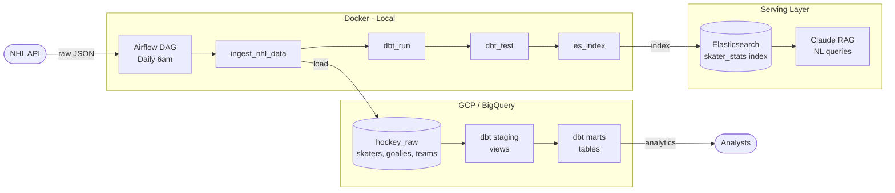

# NHL Hockey Pipeline

An end-to-end data engineering pipeline that ingests NHL statistics from the NHL API, transforms them using dbt, and orchestrates the workflow with Apache Airflow; all running on Google Cloud Platform.

## Architecture

Orchestrated by Apache Airflow on a daily schedule.



## Tech Stack

- **Orchestration:** Apache Airflow 3.x (Docker)
- **Transformation:** dbt (BigQuery adapter)
- **Data Warehouse:** Google BigQuery
- **Cloud:** Google Cloud Platform
- **Language:** Python 3.12

## Data Models

### Staging Layer
Raw NHL API data cleaned and renamed:
- `stg_skaters` — skater stats per season
- `stg_goalies` — goalie stats per season
- `stg_teams` — team stats per season

### Marts Layer
Business-ready models with derived metrics:
- `mart_skater_stats` — points per game, goals per game, shots per game
- `mart_goalie_stats` — win percentage, calculated save percentage
- `mart_team_standings` — goal differential, goals for/against per game

## AI / RAG Layer

A natural language query tool powered by Claude and Elasticsearch. Ask questions in plain English and get hockey analytics insights back.

Uses a two-step LLM pattern:
1. **Query generation** — Claude interprets the question and generates an Elasticsearch query
2. **Analysis** — Claude analyzes the results and returns a natural language answer

Example questions:
- "Tell me about Connor McDavid's season"
- "Who are the best snipers on the Oilers?"
- "Which defensemen have the best plus minus?"
- "Who are the top power play performers?"

## Pipeline

The Airflow DAG runs daily at 6am and executes three tasks in sequence:

1. **ingest_nhl_data** — hits the NHL API and loads raw JSON into BigQuery
2. **dbt_run** — runs all dbt models to transform raw data into analytics-ready tables
3. **dbt_test** — runs data quality tests to validate the output

## Local Development

### Prerequisites
- Docker Desktop
- Python 3.12+
- Google Cloud SDK
- A GCP project with BigQuery enabled

### Setup

1. Clone the repo
```bash
   git clone https://github.com/slansford/hockey-pipeline.git
   cd hockey-pipeline
```

2. Set up Python environment
```bash
   python3 -m venv .venv
   source .venv/bin/activate
   pip install dbt-bigquery
```

3. Authenticate with GCP
```bash
   gcloud auth application-default login
   gcloud auth application-default set-quota-project YOUR_PROJECT_ID
```

4. Configure dbt
```bash
   cd hockey_dbt
   dbt debug
```

5. Start Airflow
```bash
   cd airflow
   docker compose up -d
```

6. Open Airflow UI at http://localhost:8080 and trigger the `hockey_pipeline` DAG

## Data Quality

dbt tests run automatically after every transformation:
- `not_null` checks on all key fields
- `unique` checks on player and team identifiers
- `accepted_values` checks on position codes