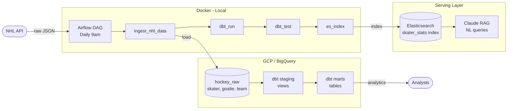

# NHL Hockey Pipeline

An end-to-end data engineering pipeline built to demonstrate proficiency with modern data engineering tools. Ingests statistics from the NHL into BigQuery, transforms and qualifies them with dbt, and indexes them with Elasticsearch; all orchestrated by Apache Airflow running on a custom Docker image. Includes a Claude-powered RAG model for querying player stats in natural language.

## Architecture

Orchestrated by Apache Airflow on a daily schedule.



## Tech Stack

- **Orchestration:** Apache Airflow 3.2.2
- **Data Warehouse:** Google BigQuery on Google Cloud Platform
- **Transformation:** dbt (BigQuery adapter)
- **Language:** Python 3.12
- **Containerization:** Docker
- **Search & Indexing:** Elasticsearch 8.13
- **AI / RAG:** Claude (Anthropic API)


## Data Models

### Staging Layer
Raw NHL API data cleaned and renamed:
- `stg_skater` — skater stats per season
- `stg_goalie` — goalie stats per season
- `stg_team` — team stats per season

### Marts Layer
Business-ready models with derived metrics:
- `mart_skater_stats` — points per game, goals per game, shots per game
- `mart_goalie_stats` — win percentage, calculated save percentage
- `mart_team_standings` — goal differential, goals for/against per game

## AI / RAG Layer

A natural language query tool powered by Claude and Elasticsearch. Ask questions in plain English and get hockey analytics insights back.

Uses a two-step LLM pattern:
1. **Query generation** — Claude interprets the question and generates an Elasticsearch query
2. **Analysis** — Claude analyzes the results and returns a natural language answer

Example questions:
- "Tell me about Sidney Crosby's season"
- "Which defensemen have the best plus minus?"
- "Who are the top power play performers?"

## Pipeline

The Airflow DAG runs daily at 9am and executes four tasks in sequence:

1. **ingest_nhl_data** - hits the NHL API and loads raw JSON into BigQuery
2. **dbt_run** - runs all dbt models to transform raw data into serving-ready tables
3. **dbt_test** - runs data quality tests to validate the output
4. **es_index** -Indexes data from `mart_skater_stats` into Elasticsearch for RAG querying

## Local Development

### Prerequisites
- Docker Desktop with WSL2 integration (Windows) or Docker Desktop (Mac/Linux)
- Python 3.12+
- Google Cloud SDK (`gcloud` CLI)
- A GCP project with BigQuery API enabled
- An Anthropic API key (for the RAG model)
- Git

### Setup

1. Clone the repo
```bash
git clone https://github.com/slansford/hockey-pipeline.git
cd hockey-pipeline
```

2. Set up Python environment
```bash
python3 -m venv .venv
source .venv/bin/activate
```

3. Authenticate with GCP
```bash
gcloud auth application-default login
gcloud auth application-default set-quota-project YOUR_PROJECT_ID
```

4. Run setup script
```bash
python setup.py
```
This configures your GCP project, BigQuery dataset, dbt profiles, Anthropic API key, and adds the `hockey` CLI alias.

5. Restart your terminal then verify dbt connection
```bash
cd dbt
dbt debug
```

6. Start Airflow and Elasticsearch
```bash
cd airflow
docker compose up -d
```

7. Open the Airflow UI at http://localhost:8080 and trigger the `hockey_pipeline` DAG
This will create a 'hockey_raw' and 'hockey_dbt_dev' datasets in BigQuery in your project, for the raw data and dbt models.

8. Query hockey stats from the command line
```bash
hockey "who has the most points?"
```

## Data Quality

dbt tests run automatically after every transformation:
- `not_null` checks on all key fields
- `unique` checks on player and team identifiers
- `accepted_values` checks on position codes